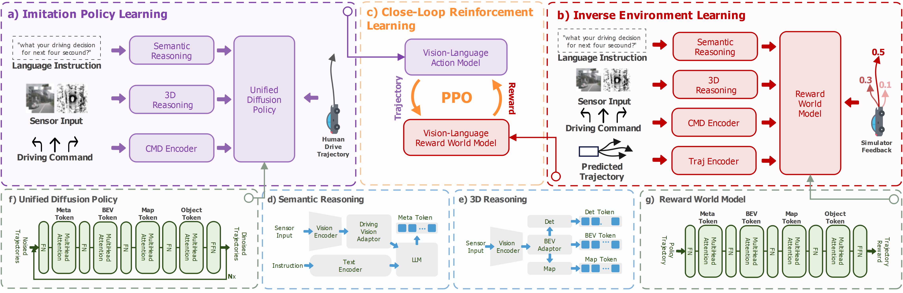

<div align="center">
<h3>IRL-VLA: Training an Vision-Language-Action Policy via Reward World Model</h3>

<a href="https://arxiv.org/abs/2508.06571"></a>
<a href="https://github.com/IRL-VLA/IRL-VLA"></a>
<!-- <a href="https://ieeexplore.ieee.org/document/10592819"></a>
<a href="https://www.arxiv.org/pdf/2508.01778"></a>
<a href="https://www.arxiv.org/pdf/2508.01778"></a> -->

</div>


## Overview



## Abstract         

Vision-Language-Action (VLA) models have demonstrated potential in autonomous driving. However, two critical challenges hinder their development: (1) Existing VLA architectures are typically based on imitation learning in open-loop setup which tends to capture the recorded behaviors in the dataset, leading to suboptimal and constrained performance, (2) Close-loop training relies heavily on high-fidelity sensor simulation, where domain gaps and computational inefficiencies pose significant barriers. In this paper, we introduce IRL-VLA, a novel close-loop Reinforcement Learning via \textbf{I}nverse \textbf{R}einforcement \textbf{L}earning reward world model with a self-built VLA approach. Our framework proceeds in a three-stage paradigm: In the first stage, we propose a VLA architecture and pretrain the VLA policy via imitation learning. In the second stage, we construct a lightweight reward world model via inverse reinforcement learning to enable efficient close-loop reward computation. To further enhance planning performance, finally, we design specialized reward world model guidence reinforcement learning via PPO(Proximal Policy Optimization) to effectively balance the safety incidents, comfortable driving, and traffic efficiency. Our approach achieves state-of-the-art performance in NAVSIM v2 end-to-end driving benchmark, 1st runner up in CVPR2025 Autonomous Grand Challenge. We hope that our framework will accelerate VLA research in close-loop autonomous driving.


## News
`[2025/08/12]` [ArXiv](https://arxiv.org/abs/2508.06571) paper release. Code/Models are coming soon. Please stay tuned! ☕️\

## Updates
We are going to release code step by step:

- [ ] Imitation Learning based VLA
- [ ] Reward World Model (IRL)
- [ ] Reinforcement Learning based VLA

Note: Code needs to be cleaned and I will open source all the code within next several month. As I promised.

## 📄 Citation

If you find IRL-VLA is useful in your research or applications, please consider giving us a star 🌟 and citing it by the following BibTeX entry.

```bibtex
@misc{jiang2025irlvlatrainingvisionlanguageactionpolicy,
      title={IRL-VLA: Training an Vision-Language-Action Policy via Reward World Model}, 
      author={Anqing Jiang and Yu Gao and Yiru Wang and Zhigang Sun and Shuo Wang and Yuwen Heng and Hao Sun and Shichen Tang and Lijuan Zhu and Jinhao Chai and Jijun Wang and Zichong Gu and Hao Jiang and Li Sun},
      year={2025},
      eprint={2508.06571},
      archivePrefix={arXiv},
      primaryClass={cs.AI},
      url={https://arxiv.org/abs/2508.06571}, 
}
```

```bibtex
@misc{jiang2025diffvlavisionlanguageguideddiffusion,
      title={DiffVLA: Vision-Language Guided Diffusion Planning for Autonomous Driving}, 
      author={Anqing Jiang and Yu Gao and Zhigang Sun and Yiru Wang and Jijun Wang and Jinghao Chai and Qian Cao and Yuweng Heng and Hao Jiang and Yunda Dong and Zongzheng Zhang and Xianda Guo and Hao Sun and Hao Zhao},
      year={2025},
      eprint={2505.19381},
      archivePrefix={arXiv},
      primaryClass={cs.AI},
      url={https://arxiv.org/abs/2505.19381}, 
}
```